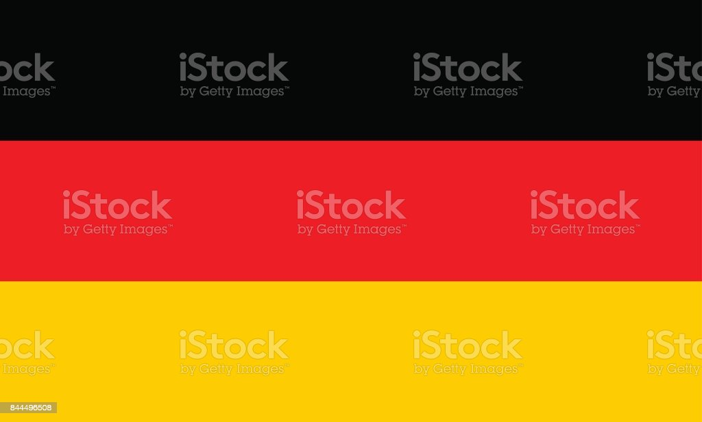
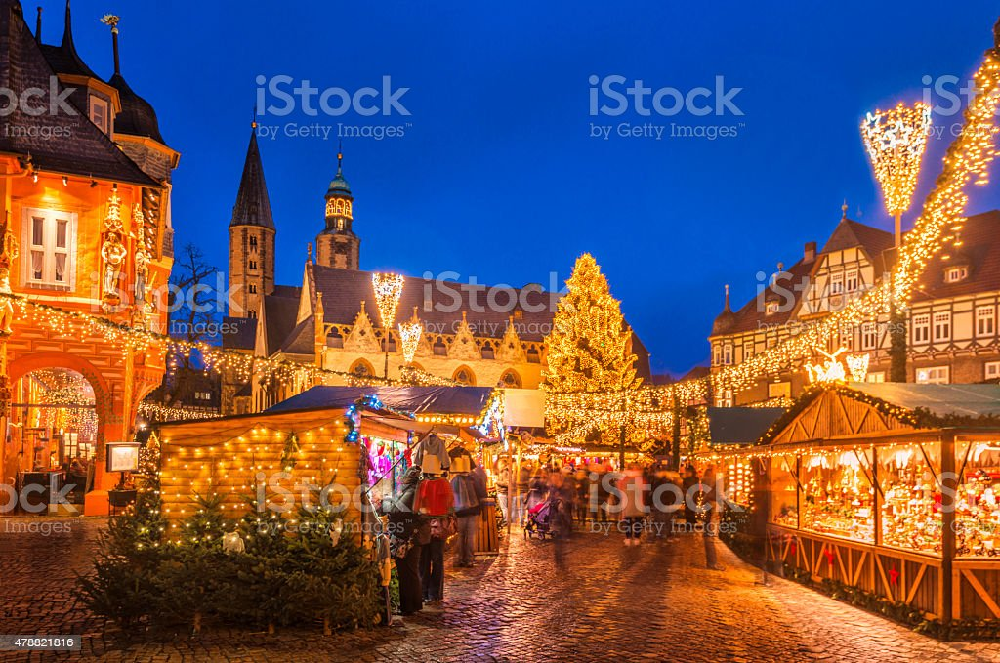
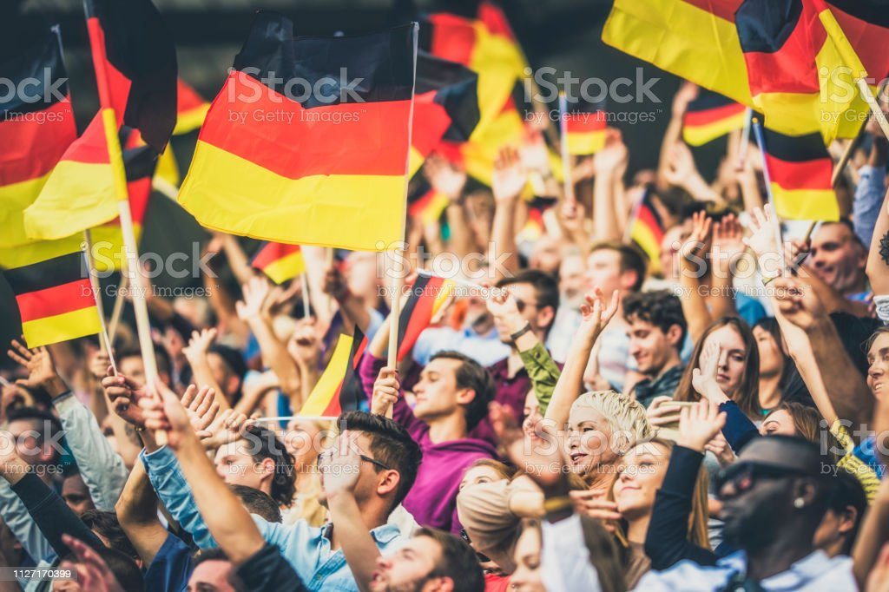
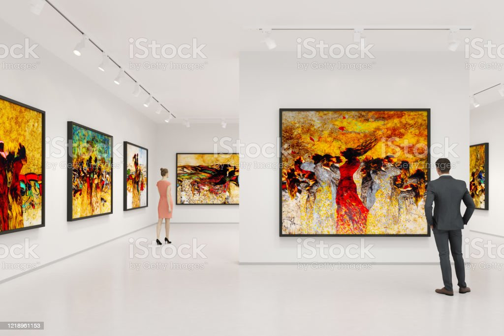
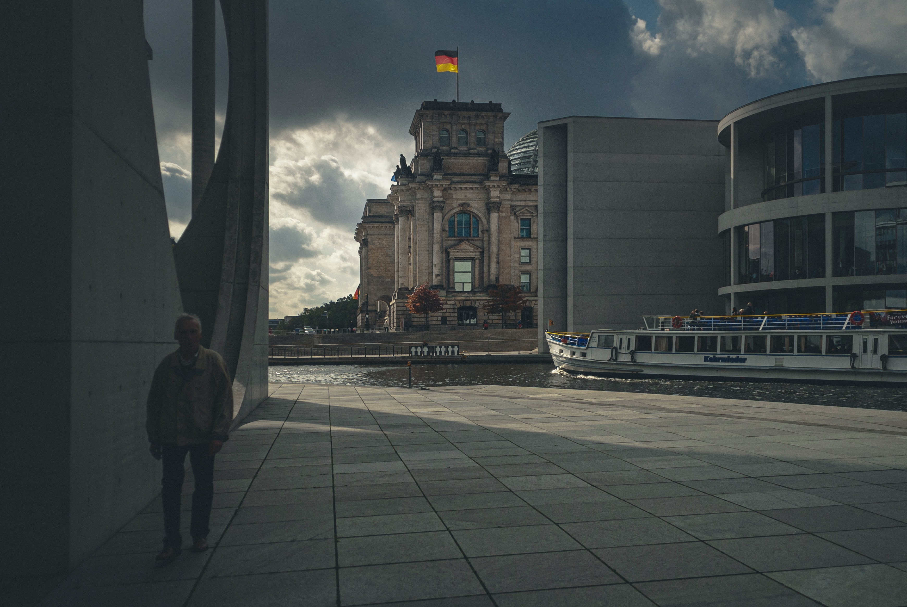

# Germany

Central Europe.
Bordered by Denmark, Poland, Czech Republic, Austria, Switzerland, France, Luxembourg, Belgium, Netherlands.
Capital and largest city: Berlin.

---

# History:

Holy Roman Empire
Center of Protestant Reformation.
19th century: unified nation-state, leading role in European politics and culture.
20th century: two devastating world wars, Nazi rule under Hitler.
Post-WWII: divided into East and West Germany.

---

# Reunification and Economic Power:

1990: reunified.
One of the world's leading economic powers.
Engineering and technological innovation.
Home to numerous multinational corporations.

---

# Culture and Arts:

Music, literature, art, and film.
Influential thinkers such as Immanuel Kant, Friedrich Nietzsche, and Martin Heidegger.
Artists such as Johann Sebastian Bach, Ludwig van Beethoven, and Johann Wolfgang von Goethe.

---

# Politics and Government:

Member of the European Union.
Plays an important role in international politics.
Federal system of government.
16 states and a chancellor as head of government.

---

# Social Welfare Programs and Economy:

High standard of living.
Strong social welfare programs.
Strong economy.

---

# Conclusion:

Germany is a diverse and complex country with a rich history, vibrant culture, and strong economy.
It has played a significant role in shaping European politics and culture, and continues to be a major player in the international arena.

